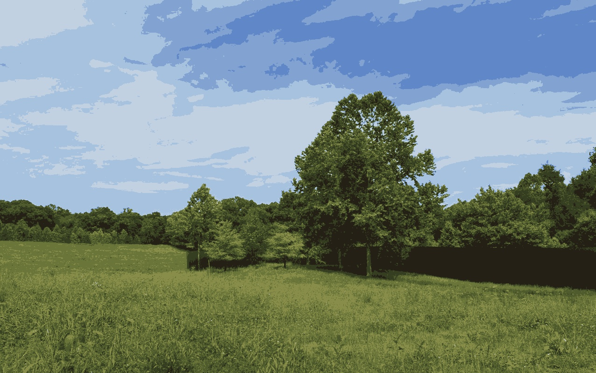
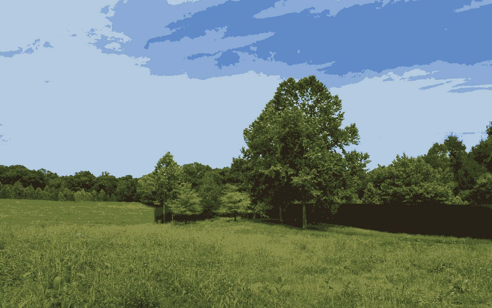
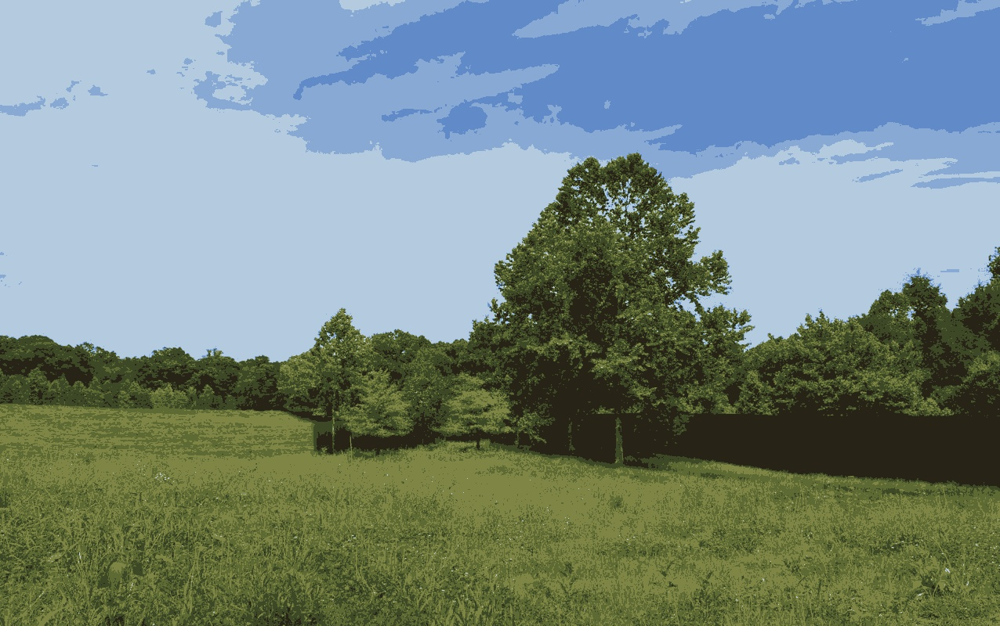
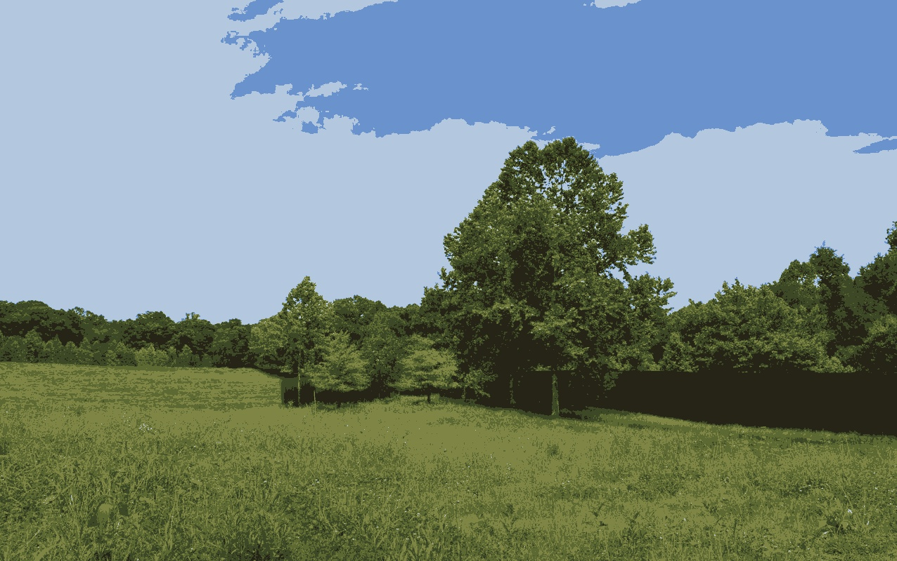
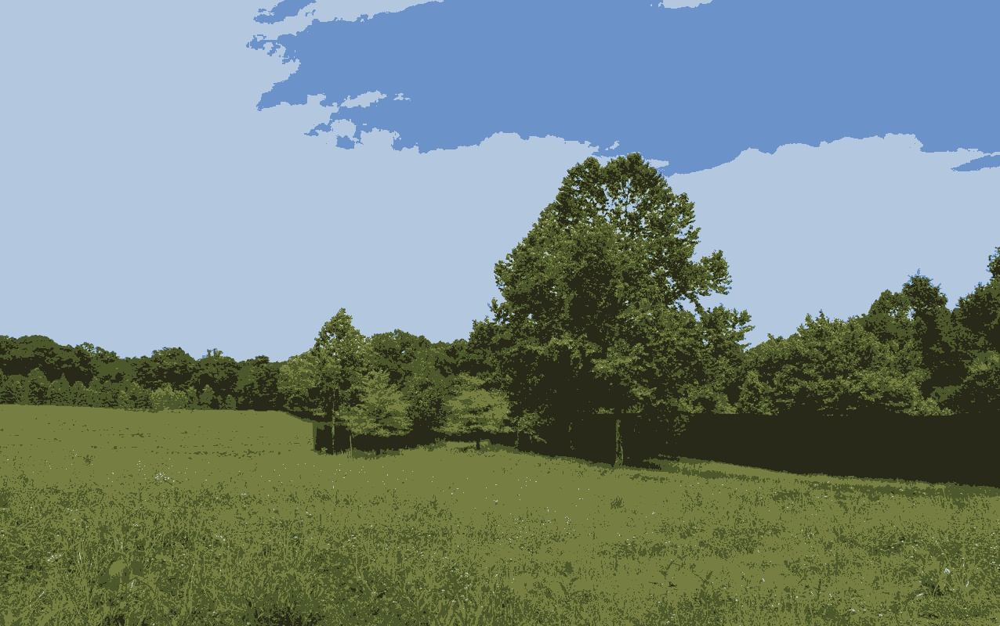
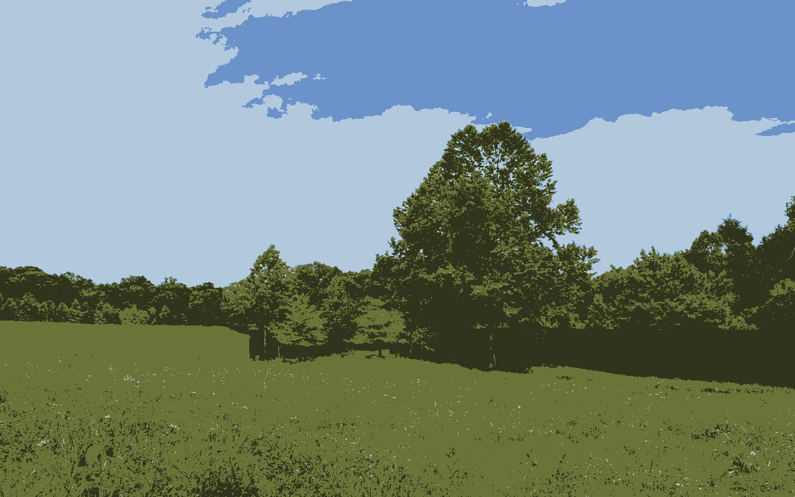
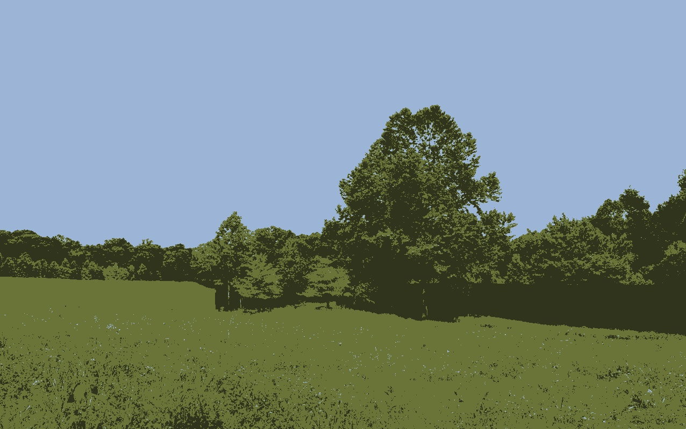

# image-segmentation-kmeans

#### Image Segmentation is a very broad field. Though [K-Means Clustering](https://en.wikipedia.org/wiki/K-means_clustering) isn't the state-of-the-art method for segmentation or compressing, still it's one of the very basic and intuitive methods. 

 

#### Here I have shown some results with different values of K (number of clusters). 

 

#### Fun Fact: You can create a lot of material style art from this code. Time for a new wallpaper!!!

 

Input Image                |  K = 9
:-------------------------:|:-------------------------:
  |  

K = 8                      |  K = 7
:-------------------------:|:-------------------------:
  |  

K = 6                      |  K = 5
:-------------------------:|:-------------------------:
  |  

K = 4                      |  K = 3
:-------------------------:|:-------------------------:
  |  
